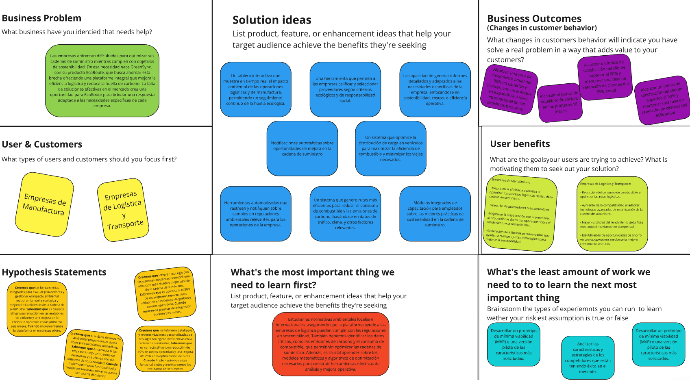

<h3 align="center"> Universidad Peruana de Ciencias Aplicadas </h3>

<h3 align="center"> Ingeniería de Software </h3>
<h3 align="center"> Ciclo 2024-02 </h3>

 

  

 
<h3 align="center"> Desarrollo de Aplicaiones Open Source - SW56 </h3>
<h3 align="center"> Profesor del Curso: Efraín Ricardo Bautista Ubillús </h3>
<h3 align="center"> "INFORME DE TRABAJO FINAL"</h3>
<h3 align="center"> STARTUP: GreenSync </h3>

<h3 align="center"> PRODUCTO: "EcoRoute"</h3>

| Miembro                                |    Código     |
| :------------------------------------- | :-----------: |
| Barturen Guzman, Alejandro Nicolas     | U202214406    |
|     |    |
|            |     |
|      |     |
| Salvador Rodríguez, Rodrigo Jesús      |  U202213646    |

<h3 align="center"> 2024 </h3>

 

# **Registro de Versiones del Informe**

<table BORDER>
    <tr>
        <td>VERSION</td>
        <td>FECHA</td>
        <td> AUTOR </td>
        <td>DESCRIPCION DE MODIFICACION</td>
    </tr>
    <tr>
        <td>1.0</td>
        <td>23/08/2024</td>
        <td>Alejandro Nicolás Barturen Guzmán - U202214406
          Rodrigo Jesús Salvador Rodríguez - U202213646 </td>
        <td>Primera versión del Proyecto Final (TB1). Se desarrollaron todos las partes para culminar con el capítulo 1</td>
    </tr>
    <tr>
        <td>1.1</td>
        <td>27/08/2024</td>
        <td>Alejandro Nicolás Barturen Guzmán - U202214406</td>
        <td>Implementación de la parte de Competidores y el Diseño de entrevistas</td>
    </tr>
    <tr>
        <td>1.2</td>
        <td>29/08/2024</td>
        <td>Alejandro Nicolás Barturen Guzmán - U202214406</td>
        <td>Implementación de las US y el to-be map</td>
    </tr>
  <tr>
        <td>1.3</td>
        <td>31/08/2024</td>
        <td>Rodrigo Jesús Salvador Rodríguez - U202213646</td>
        <td>Implementación del Impact Mapping</td>
    </tr>
   <tr>
        <td>1.4</td>
        <td>01/09/2024</td>
        <td>Rodrigo Jesús Salvador Rodríguez - U202213646</td>
        <td>Implementación del Product Backlog y su entrevista</td>
    </tr>
   <tr>
        <td>1.5</td>
        <td>02/09/2024</td>
        <td>Rodrigo Jesús Salvador Rodríguez - U202213646</td>
        <td>Realización del Sprint Planning 1 y Sprint Backlog 1</td>
    </tr>
</table>

# **Project Report Collaboration Insights**

URL del repositorio de la Organizacion: <https://github.com/Grupo3-OpenSource-SW56/Informe-Trabajo>

# **Student Outcome**
|Criterio especifico|Acciones realizadas|Conclusiones|
|-|:-|-|
|Comunica en forma escrita ideas y/o resultados con objetividad a público de diferentes especialidades y niveles jerarquicos, en el marco del desarrollo de un proyecto en ingeniería.|**Rodrigo Salvador**   TB1: En esta entrega se realizó la definición de la Startup Profile, Impact Mapping, Product Backlog, Sprint Planning y Sprint Backlog 1. Una característica a tomar en cuenta  es la alineación de objetivos estratégicos con tareas específicas, priorizando funcionalidades esenciales para maximizar el valor del producto.   **Alejandro Barturen**   TB1:|Se logró realizar un trabajo a tiempo y aceptable, pues cumplimos con todas las partes del trabajo, de tal manera que se pueda entregar un trabajo digno. El documento elaborado proporciona una referencia escrita para quienes busquen entender en profundidad los procesos de planificación, desarrollo y despliegue del proyecto en elaboración y corrección constante.|
|Comunica oralmente sus ideas y/o resultados con objetividad a público de diferentes especialidades y niveles jerarquicos, en el marco del desarrollo de un proyecto en ingeniería.|**Rodrigo Salvador**   TB1: En esta entrega se realizó el proceso de entrevistas en base a los segmentos objetivos seleccionados. Se comunicó oralmente a través de las personas entrevistadas nuestro objetivo y lo que esperamos hacer en el proyecto.   **Alejandro Barturen**   TB1:|Como equipo pudimos establecer medios de comunicación como las redes sociales, para lograr entregar un trabajo integral pese a la limitación de los plazos ajustados para los avances del proyecto.|

# **Contenido**
### Tabla de contenidos
- [**Registro de Versiones del Informe**](#registro-de-versiones-del-informe)
- [**Project Report Collaboration Insights**](#project-report-collaboration-insights)
- [**Contenido**](#contenido)
    - [Tabla de contenidos](#tabla-de-contenidos)
- [**Student Outcome**](#student-outcome)
- [ **Capítulo I: Introducción** ](#-capítulo-i-introducción-)
  - [**1.1. Startup Profile**](#11-startup-profile)
    - [**1.1.1. Descripción de la Startup**](#111-descripción-de-la-startup)
    - [**1.1.2. Perfiles de integrantes del equipo**](#112-perfiles-de-integrantes-del-equipo)
  - [**1.2. Solution Profile**](#12-solution-profile)
    - [**1.2.1 Antecedentes y problemática**](#121-antecedentes-y-problemática)
    - [What (¿Qué?)](#what-qué)
    - [Who (¿Quién?)](#who-quién)
    - [Where (¿Dónde?)](#where-dónde)
    - [When (¿Cuándo?)](#when-cuándo)
    - [Why (¿Por qué?)](#why-por-qué)
    - [How (¿Cómo?)](#how-cómo)
    - [How much (¿Cuánto?)](#how-much-cuánto)
    - [**1.2.2 Lean UX Process**](#122-lean-ux-process)
    - [**1.2.2.1. Lean UX Problem Statements**](#1221-lean-ux-problem-statements)
    - [**1.2.2.2. Lean UX Assumptions**](#1222-lean-ux-assumptions)
    - [**1.2.2.3. Lean UX Hypothesis Statements**](#1223-lean-ux-hypothesis-statements)
    - [**1.2.2.4. Lean UX Canvas**](#1224-lean-ux-canvas)
  - [**1.3. Segmentos objetivo**](#13-segmentos-objetivo)
- [ **Capítulo II: Requirements Elicitation \& Analysis**](#-capítulo-ii-requirements-elicitation--analysis)
  - [**2.1. Competidores**](#21-competidores)
    - [**2.1.1. Análisis competitivo**](#211-análisis-competitivo)
    - [**2.1.2. Estrategias y tácticas frente a competidores**](#212-estrategias-y-tácticas-frente-a-competidores)
  - [**2.2. Entrevistas**](#22-entrevistas)
    - [**2.2.1. Diseño de entrevistas**](#221-diseño-de-entrevistas)
    - [**2.2.2. Registro de entrevistas**](#222-registro-de-entrevistas)
    - [**2.2.3. Análisis de entrevistas**](#223-análisis-de-entrevistas)
  - [**2.3. Needfinding**](#23-needfinding)
    - [**2.3.1. User Personas**](#231-user-personas)
    - [**2.3.2. User Task Matrix**](#232-user-task-matrix)
    - [**2.3.3. User Journey Mapping**](#233-user-journey-mapping)
    - [**2.3.4. Empathy Mapping**](#234-empathy-mapping)
    - [**2.3.5. As-is Scenario Mapping**](#235-as-is-scenario-mapping)
  - [**2.4. Ubiquitous Language**](#24-ubiquitous-language)
- [ **Capítulo III: Requirements Specification**](#-capítulo-iii-requirements-specification)
  - [**3.1. To-Be Scenario Mapping**](#31-to-be-scenario-mapping)
  - [**3.2. User Stories**](#32-user-stories)
  - [**3.3. Impact Mapping**](#33-impact-mapping)
  - [**3.4. Product Backlog**](#34-product-backlog)
- [**Capítulo IV: Product Design**](#capítulo-iv-product-design)
  - [**4.1. Style Guidelines**](#41-style-guidelines)
    - [**4.1.1. General Style Guidelines**](#411-general-style-guidelines)
    - [**4.1.2. Web Style Guidelines**](#412-web-style-guidelines)
  - [**4.2. Information Architecture**](#42-information-architecture)
    - [**4.2.1. Organization Systems**](#421-organization-systems)
    - [**4.2.2. Labeling Systems**](#422-labeling-systems)
    - [**4.2.3. SEO Tags and Meta Tags**](#423-seo-tags-and-meta-tags)
    - [**4.2.4. Searching Systems**](#424-searching-systems)
    - [**4.2.5. Navigation Systems**](#425-navigation-systems)
  - [**4.3. Landing Page UI Design**](#43-landing-page-ui-design)
    - [**4.3.1. Landing Page Wireframe**](#431-landing-page-wireframe)
    - [**4.3.2. Landing Page Mock-up**](#432-landing-page-mock-up)
  - [**4.4. Web Applications UX/UI Design**](#44-web-applications-uxui-design)
    - [**4.4.1. Web Applications Wireframes**](#441-web-applications-wireframes)
    - [**4.4.2. Web Applications Wireflow Diagrams**](#442-web-applications-wireflow-diagrams)
    - [**4.4.3. Web Applications Mock-ups**](#443-web-applications-mock-ups)
    - [**4.4.4. Web Applications User Flow Diagrams**](#444-web-applications-user-flow-diagrams)
  - [**4.5. Web Applications Prototyping**](#45-web-applications-prototyping)
  - [**4.6. Domain-Driven Software Architecture**](#46-domain-driven-software-architecture)
    - [**4.6.1. Software Architecture Context Diagram**](#461-software-architecture-context-diagram)
    - [**4.6.2. Software Architecture Container Diagrams**](#462-software-architecture-container-diagrams)
    - [**4.6.3. Software Architecture Components Diagrams**](#463-software-architecture-components-diagrams)
  - [**4.7. Software Object-Oriented Design**](#47-software-object-oriented-design)
    - [**4.7.1. Class Diagrams**](#471-class-diagrams)
    - [**4.7.2. Class Dictionary**](#472-class-dictionary)
  - [**4.8. Database Design**](#48-database-design)
    - [**4.8.1. Database Diagram**](#481-database-diagram)
- [**Capítulo V: Product Implementation, Validation \& Deployment**](#capítulo-v-product-implementation-validation--deployment)
  - [**5.1. Software Configuration Management**](#51-software-configuration-management)
    - [**5.1.1. Software Development Environment Configuration**](#511-software-development-environment-configuration)
    - [**5.1.2. Source Code Management**](#512-source-code-management)
    - [**5.1.3. Source Code Style Guide \& Conventions**](#513-source-code-style-guide--conventions)
    - [**5.1.4. Software Deployment Configuration**](#514-software-deployment-configuration)
  - [**5.2. Landing Page, Services \& Applications Implementation**](#52-landing-page-services--applications-implementation)
    - [**5.2.1. Sprint 1**](#521-sprint-1)
        - [**5.2.1.1. Sprint Planning 1**](#5211-sprint-planning-1)
        - [**5.2.1.2. Sprint Backlog 1**](#5212-sprint-backlog-1)
        - [**5.2.1.3. Development Evidence for Sprint Review**](#5213-development-evidence-for-sprint-review)
        - [**5.2.1.4. Testing Suite Evidence for Sprint Review**](#5214-testing-suite-evidence-for-sprint-review)
        - [**5.2.1.5. Execution Evidence for Sprint Review**](#5215-execution-evidence-for-sprint-review)
        - [**5.2.1.6. Services Documentation Evidence for Sprint Review**](#5216-services-documentation-evidence-for-sprint-review)
        - [**5.2.1.7. Software Deployment Evidence for Sprint Review**](#5217-software-deployment-evidence-for-sprint-review)
        - [**5.2.1.8. Team Collaboration Insights during Sprint**](#5218-team-collaboration-insights-during-sprint)
    - [**5.2.2. Sprint 2**](#522-sprint-2)
        - [**5.2.2.1. Sprint Planning 2**](#5221-sprint-planning-2)
        - [**5.2.2.2. Sprint Backlog 2**](#5222-sprint-backlog-2)
        - [**5.2.2.3. Development Evidence for Sprint Review**](#5223-development-evidence-for-sprint-review)
        - [**5.2.2.4. Testing Suite Evidence for Sprint Review**](#5224-testing-suite-evidence-for-sprint-review)
        - [**5.2.2.5. Execution Evidence for Sprint Review**](#5225-execution-evidence-for-sprint-review)
        - [**5.2.2.6. Services Documentation Evidence for Sprint Review**](#5226-services-documentation-evidence-for-sprint-review)
        - [**5.2.2.7. Software Deployment Evidence for Sprint Review**](#5227-software-deployment-evidence-for-sprint-review)
        - [**5.2.2.8. Team Collaboration Insights during Sprint**](#5228-team-collaboration-insights-during-sprint)
    - [**5.2.3. Sprint 3**](#523-sprint-3)
        - [**5.2.3.1. Sprint Planning 3**](#5231-sprint-planning-3)
        - [**5.2.3.2. Sprint Backlog 3**](#5232-sprint-backlog-3)
        - [**5.2.3.3. Development Evidence for Sprint Review**](#5233-development-evidence-for-sprint-review)
        - [**5.2.3.4. Testing Suite Evidence for Sprint Review**](#5234-testing-suite-evidence-for-sprint-review)
        - [**5.2.3.5. Execution Evidence for Sprint Review**](#5235-execution-evidence-for-sprint-review)
        - [**5.2.3.6. Services Documentation Evidence for Sprint Review**](#5236-services-documentation-evidence-for-sprint-review)
        - [**5.2.3.7. Software Deployment Evidence for Sprint Review**](#5237-software-deployment-evidence-for-sprint-review)
        - [**5.2.3.8. Team Collaboration Insights during Sprint**](#5238-team-collaboration-insights-during-sprint)
    - [**5.2.4. Sprint 4**](#524-sprint-4)
        - [**5.2.4.1. Sprint Planning 4**](#5241-sprint-planning-4)
        - [**5.2.4.2. Sprint Backlog 4**](#5242-sprint-backlog-4)
        - [**5.2.4.3. Development Evidence for Sprint Review**](#5243-development-evidence-for-sprint-review)
        - [**5.2.4.4. Testing Suite Evidence for Sprint Review**](#5244-testing-suite-evidence-for-sprint-review)
        - [**5.2.4.5. Execution Evidence for Sprint Review**](#5245-execution-evidence-for-sprint-review)
        - [**5.2.4.6. Services Documentation Evidence for Sprint Review**](#5246-services-documentation-evidence-for-sprint-review)
        - [**5.2.4.7. Software Deployment Evidence for Sprint Review**](#5247-software-deployment-evidence-for-sprint-review)
        - [**5.2.4.8. Team Collaboration Insights during Sprint**](#5248-team-collaboration-insights-during-sprint)
  - [**5.3. Validation Interviews**](#53-validation-interviews)
    - [**5.3.1. Diseño de Entrevistas**](#531-diseño-de-entrevistas)
    - [**5.3.2. Registro de Entrevistas**](#532-registro-de-entrevistas)
    - [**5.3.3. Evaluaciones según heurísticas**](#533-evaluaciones-según-heurísticas)
  - [**5.4. Video About-the-Product**](#54-video-about-the-product)
- [**Conclusiones**](#conclusiones)
- [**Conclusiones y recomendaciones**](#conclusiones-y-recomendaciones)
- [**Video About-the-Team**](#video-about-the-team)
- [**Bibliografía**](#bibliografía)
- [**Anexos**](#anexos)

#  **Capítulo I: Introducción** 
## **1.1. Startup Profile**
### **1.1.1. Descripción de la Startup**
GreenSync es una startup innovadora que se centra en ofrecer una solución  a las empresas ayudando a optimizar sus  cadenas de suministros y volverlas  más sostenibles y eficientes.Todo esto haciendo uso de su plataforma,EcoRoute. Ofrece servicios que involucran desde el análisis de los proveedores para medir su eficiencia y cumplimiento con los estándares medioambientales,  Supervisión de las operaciones en la cadena de suministros y Análisis del impacto ambiental, hasta Optimización de procesos logísticos e integración de sistemas existentes. Proporcionando toda esta información  mediante la intuitiva plataforma web se espera que las empresas que puedan tomar la mejor decisión en términos de ambiente y logísticos  

**Misión**: Ayudar a la preservación del medio ambiente a la vez de aumentar la eficiencia de las rutas de suministros de las empresas \
**Visión**: EcoRoute será una de las principales causas en la reducción de la contaminación y destaca como una de las principales plataformas destinadas a la gestion de suministros

### **1.1.2. Perfiles de integrantes del equipo**
<table BORDER>
    <tr>
        <td>Perfiles de los integrantes del equipo</td>
        <td></td>
    </tr>
      <tr>
        <td> </td>
        <td>Mi nombre es Alejandro Nicolas Barturen Guzman. Tengo 20 años y estoy estudiando la carrera de ingeniería de software en la UPC y me encuentro en 5to ciclo. Soy una persona imaginativa, lo que me ayuda a aportar soluciones para resolver los problemas en común. También me considero  colaborativo y ordenado  lo que facilita el trabajo en equipo con mis compañeros.Tengo conocimiento  de los lenguajes de programación C++, Python, Java y Javascript. Además, tengo conocimiento de UI,  UX  y software de control de versiones. </td>
    </tr>
<tr>
        <td> </td>
        <td>Me llamo Rodrigo Jesús Salvador Rodríguez, tengo 19 años, estudio la carrera de Ingeniería de Software en la Universidad Peruana de Ciencias Aplicadas (UPC) cursando el 5to Ciclo. Tengo conocimientos de lenguaje C++, C#, Python, también cuento con aprendizaje acerca de los sistemas operativos y deseo seguir expandiendo más mi conocimiento. Me considero una persona responsable y puntual en todo tipo de aspectos, esto lo voy a ver reflejado en este proyecto, como miembro de este equipo me comprometo a seguir las indicaciones al pie de la letra, seguir recomendaciones y apoyar siempre a mis compañeros para presentar el mejor proyecto grupal. </td>
    </tr>
    
</table>

## **1.2. Solution Profile**

Product Name: **EcoRoute**  

Product Description:  \
Monetización: EcoRoute funciona mediante un modelo de suscripción mensual, con una prueba gratuita en el Plan Básico de 10 días para que los nuevos usuarios puedan conocer cómo funciona el producto. Hay tres planes de suscripción disponibles para que el usuario sea libre de elegir el que mejor se acomode a sus necesidades. 
- **Plan Básico**: Evaluación de proveedores y gestión básica de la cadena de suministro. 
- **Plan Profesional**: Análisis de impacto ambiental y optimización de procesos. 
- **Plan Corporativo**: Integración con sistemas existentes y consultoría especializada.

### **1.2.1 Antecedentes y problemática**
### What (¿Qué?)
**¿Cuál es el problema?** \
Las cadenas de suministro actuales enfrentan varios desafíos en términos de sostenibilidad y eficiencia. Muchas empresas tienen dificultades para evaluar el impacto ambiental de sus operaciones y gestionar sus proveedores de manera que se minimice el impacto ecológico. Además, optimizar la logística para reducir costos y emisiones de dióxido de carbono es un reto constante que no siempre se aborda de manera efectiva.

### Who (¿Quién?)

**¿Quienes están involucrados?**\
Están involucrados las personas encargadas de la cadena de suministro, los gerentes de operaciones, los responsables de sostenibilidad, los analistas de datos y los directores ejecutivos que buscan cumplir con las metas de sostenibilidad de la empresa. Además, los proveedores, las autoridades regulatorias y los consumidores finales también son partes interesadas clave.

**¿Quién lo utiliza?**\
Utilizan la plataforma las empresas que buscan mejorar la sostenibilidad y la eficiencia de sus cadenas de suministro, incluyendo grandes corporaciones, medianas empresas y, potencialmente, pequeñas empresas que desean empezar a integrar prácticas más sostenibles.

### Where (¿Dónde?)

**¿Dónde surge el problema?**\
El problema surge a lo largo de toda la cadena de suministro, desde la selección de materias primas hasta la entrega del producto final. Las empresas pueden enfrentarse a estos desafíos en sus oficinas centrales, plantas de producción, centros de distribución y en cualquier lugar donde se tomen decisiones sobre la cadena de suministro.\
**¿A dónde se dirige?**\
El problema se dirige hacia una necesidad creciente de soluciones que integren la sostenibilidad en la cadena de suministro. Con el aumento de la conciencia ambiental y la demanda de transparencia por parte de los consumidores, las empresas están bajo presión para mejorar sus prácticas y reportar de manera precisa su impacto ambiental.

### When (¿Cuándo?)

**¿Cuándo sucede el problema?**\
El problema surge en cualquier momento en que una empresa gestiona su cadena de suministro de forma ineficiente. Esto puede ser durante la selección de proveedores, la planificación de la logística, o al intentar cumplir con normativas ambientales. Con el creciente enfoque en la sostenibilidad y la presión regulatoria, este problema se está volviendo más urgente y relevante para las empresas en todo momento.

### Why (¿Por qué?)
**¿Cuál es la causa del problema?**\
La causa del problema radica en la falta de herramientas integradas y accesibles que permitan a las empresas evaluar y gestionar sus cadenas de suministro con un enfoque en la sostenibilidad. Muchas empresas carecen de la tecnología adecuada y los conocimientos necesarios para analizar de manera efectiva el impacto ambiental de sus operaciones y tomar decisiones informadas que optimicen tanto la sostenibilidad como la eficiencia.

### How (¿Cómo?)
**¿Cómo se utilizará el producto?**\
El producto se utilizará a través de una plataforma en línea que proporcionará herramientas para evaluar a los proveedores, gestionar el impacto ambiental y optimizar la logística. Los usuarios podrán acceder a análisis detallados, recibir recomendaciones basadas en datos y colaborar con otros departamentos dentro de la empresa para implementar mejoras en la cadena de suministro.

**¿Cómo lograremos desarrollar la correcta gestión de cultivos de champiñones dentro de la plataforma?**\
Este es un ejemplo específico que puede ser extrapolado a la gestión de cualquier tipo de suministro. En el caso de los champiñones, la plataforma permitiría a los usuarios gestionar el ciclo de producción y distribución, optimizando los recursos y minimizando el impacto ambiental. A través de la plataforma, los agricultores y distribuidores de champiñones podrían analizar sus procesos, reducir el desperdicio y asegurarse de que sus prácticas cumplan con los estándares de sostenibilidad.

 
### How much (¿Cuánto?)

**¿Cuál es la magnitud del problema?** \
La magnitud del problema es significativa, afectando a múltiples industrias que dependen de cadenas de suministro complejas. La falta de sostenibilidad y eficiencia en estas cadenas no solo aumenta los costos operativos, sino que también contribuye significativamente a las emisiones de carbono y al agotamiento de recursos naturales.

**¿Qué porcentaje del personal de la industria se verá beneficiado por el servicio?**\
Se estima que un alto porcentaje del personal involucrado en la gestión de la cadena de suministro, incluyendo gerentes de operaciones, responsables de sostenibilidad, y analistas, se beneficiará directamente del servicio. Esto podría representar entre un 20% y un 50% del personal en industrias que dependen en gran medida de cadenas de suministro extensas y complejas.

 
### **1.2.2 Lean UX Process**
### 1.2.2.1. Lean UX Problem Statements

El propósito fundamental de EcoRoute es brindar a las empresas una solución integral para gestionar de manera sustentable y eficiente sus cadenas de suministro, permitiendo a los responsables de operaciones y sustentabilidad optimizar su impacto ambiental y mejorar la eficiencia operativa.\
\
Este desafío surge de la falta de herramientas adecuadas para la evaluación de proveedores, la gestión del impacto ambiental y  la optimización logística, lo que genera muchos problemas operativos y ambientales. Muchas empresas luchan por incorporar la sostenibilidad en sus operaciones, lo que genera mayores emisiones de carbono, altos costos operativos  y una gestión ineficiente de la cadena de suministro. Esta deficiencia se refleja principalmente en la falta de datos precisos y análisis útiles, así como en una mala integración en los sistemas existentes, lo que dificulta la toma de decisiones estratégicas informadas.\
\
 La eficiencia  y  sostenibilidad empresarial se ven afectadas por la falta de herramientas adecuadas en la gestión de la cadena de suministro. No evaluar y seleccionar proveedores sostenibles, gestionar el impacto ambiental y optimizar las operaciones logísticas puede generar problemas como un mayor impacto ambiental, costos innecesarios y el incumplimiento de las regulaciones ambientales. Además, la falta de información precisa y oportuna complica la planificación estratégica y la toma de decisiones, lo que afecta negativamente la rentabilidad y la competitividad a largo plazo de una empresa.

**Problem Statement 1:** La falta de herramientas adecuadas para evaluar proveedores y gestionar el impacto ambiental en numerosas empresas provoca una serie de problemas operativos y ambientales, como una mayor huella de carbono, costos operativos elevados y una gestión ineficaz de la cadena de suministro.

**Problem Statement 2:** La dependencia de métodos manuales y poco eficientes para la gestión de la cadena de suministro, como el registro de datos en papel y el uso de hojas de cálculo, aumenta la probabilidad de errores y complica la toma de decisiones informadas en cuanto a sostenibilidad y eficiencia.

**Problem Statement 3:** La carencia de herramientas integradas para la optimización logística y el análisis del impacto ambiental afecta la capacidad de las empresas para cumplir con sus objetivos de sostenibilidad y eficiencia, resultando en costos innecesarios, un mayor impacto ecológico y una planificación estratégica deficiente.

 
 

### 1.2.2.2. Lean UX Assumptions

- **Business Assumptions:**
1. **Creemos que nuestro usuarios necesitan** herramientas sencillas para gestionar y mejorar la sostenibilidad y eficiencia de sus cadenas de suministros  
2. **Estas necesidades se pueden satisfacer** proporcionando una plataforma que provee  análisis de proveedores, el seguimiento del impacto ambiental y la optimización logística. 
3. **Nuestros clientes iniciales serán** empresas que busquen optimizar su cadena de suministro para reducir su huella ecológica. 
4. **El valor más importante que un cliente quiere de nuestro servicio es** la capacidad de mejorar su sostenibilidad sin comprometer la eficiencia operativa. 
5. **El cliente también va a obtener** informes detallados y recomendaciones personalizadas para la optimización logística y la reducción del impacto ambiental. 
6. **Vamos a obtener la mayoría de clientes mediante** estrategias de marketing digital enfocadas en empresas ecológicas y asociaciones con organizaciones de sostenibilidad. 
7. **Vamos a obtener ingresos mediante** planes de suscripción que ofrecen diferentes niveles de acceso a las herramientas de la plataforma. 
8. **Nuestra competencia en el mercado serán** otras plataformas de sostenibilidad empresarial y software de gestión de cadenas de suministro. 
9. **Vamos a tener ventaja frente a nuestra competencia debido a** nuestra integración personalizada, consultoría especializada y enfoque exclusivo en la sostenibilidad de la cadena de suministro. 
10. **El mayor riesgo de del servicio es** la posible falta de adopción por parte de empresas que aún no priorizan la sostenibilidad. 
11. **Lo resolveremos realizando** campañas educativas que demuestren los beneficios financieros y operativos de una cadena de suministro sostenible. 

- **User Assumptions:**
  
**¿Quién es el usuario?** \
El usuario es un gerente de cadena de suministro, director de sostenibilidad o ejecutivo de operaciones en empresas medianas y grandes que buscan cumplir con estándares ambientales más rigurosos.

**¿Qué problemas tiene nuestro producto?¿Resolver?** \
Nuestro producto aborda problemas como la falta de transparencia en las cadenas de suministro y la dificultad para medir y reducir el impacto ambiental a lo largo del ciclo de vida de los productos.

**¿Qué características son importantes?** \
Los usuarios consideran cruciales características como la capacidad de evaluar la sostenibilidad de los proveedores, realizar análisis detallados del impacto ambiental y optimizar las rutas logísticas para mejorar la eficiencia operativa.

**¿Dónde encaja nuestro producto en su trabajo o vida?** \
EcoRoute encaja en el ámbito profesional del usuario como una herramienta esencial para la gestión diaria de la cadena de suministro y la sostenibilidad. Ayuda a los usuarios a cumplir con sus responsabilidades de optimización y sostenibilidad, proporcionando visibilidad constante sobre sus operaciones.

**¿Cuándo y cómo es nuestro producto? ¿Usado?** \
Nuestro producto es utilizado diariamente para realizar un seguimiento en tiempo real de las operaciones logísticas y la sostenibilidad de los proveedores. También se utiliza durante momentos clave de planificación, como al evaluar nuevos proveedores, realizar auditorías ambientales o reestructurar las operaciones logísticas para reducir costos y emisiones

**¿Cómo debe verse nuestro producto y cómo debe comportarse?** \
EcoRoute debe presentar una interfaz limpia y moderna, con un diseño responsivo que permita el acceso desde múltiples dispositivos. Debe ser visualmente atractivo y fácil de navegar, con gráficos interactivos, mapas logísticos y paneles que presenten los datos de manera clara y comprensible. En cuanto a comportamiento, el producto debe ser rápido, eficiente y altamente confiable sin generar confusión ni sobrecargar al usuario con información innecesaria.

- **Feature Assumptions:**

**Creemos que** la plataforma debe tener capacidades de colaboración en tiempo real, permitiendo a los equipos internos compartir información. \
\
**Creemos que** EcoRoute debería incorporar una función de análisis de riesgos ambientales y de suministro que identifique posibles vulnerabilidades en la cadena de suministro. \
\
**Creemos que** la plataforma debe incluir una función de seguimiento de certificaciones y regulaciones, que permita a los usuarios verificar el cumplimiento con normativas 
ambientales locales e internacionales.   
\
**Creemos que** EcoRoute debería incluir un módulo de capacitación interactivo y recursos educativos sobre prácticas sostenibles. 

### **1.2.2.3. Lean UX Hypothesis Statements**

- **Hypothesis Statement 01:**\
**Creemos que** al proporcionar herramientas integradas para evaluar proveedores y gestionar el impacto ambiental, las empresas podrán reducir significativamente su huella ecológica y mejorar la eficiencia de su cadena de suministro.
\
**Sabremos que** esta hipótesis es correcta si observamos una reducción considerable en las emisiones de carbono y un aumento en la eficiencia operativa dentro de los primeros seis meses de implementación en empresas piloto.
\
**Cuando** implementemos la plataforma en un grupo de empresas seleccionadas para monitorear y analizar los resultados.

- **Hypothesis Statement 02:**\
**Creemos que** la capacidad de integrar EcoLogix con los sistemas existentes de las empresas (como ERP y CRM) permitirá una adopción más rápida y una mejora en la gestión de la cadena de suministro.
  \
**Sabremos que** esta hipótesis es correcta si el 80% de las empresas que usan la integración informan una reducción en el tiempo necesario para gestionar la cadena de suministro y una disminución en los errores operativos.
  \
**Cuando** realicemos una fase de prueba con empresas que integren EcoLogix con sus sistemas actuales y evaluemos los resultados en un período de tres meses.

- **Hypothesis Statement 03:**\
**Creemos que** la función de análisis de impacto ambiental proporcionará a las empresas datos precisos y útiles para tomar decisiones más sostenibles y responsables.
  \
**Sabremos** que esta hipótesis es correcta si las empresas que utilizan el análisis de impacto informan una mejora en la toma de decisiones y un alineamiento más cercano con sus objetivos de sostenibilidad.
  \
**Cuando** implementemos la funcionalidad en empresas y recojamos feedback sobre cómo estos datos están siendo utilizados para tomar decisiones.

- **Hypothesis Statement 04:**\
**Creemos que** los informes detallados y las recomendaciones personalizadas de EcoLogix ayudarán a las empresas a identificar y corregir ineficiencias en su cadena de suministro de manera más efectiva.
  \
**Sabremos** que esta hipótesis es correcta si observamos una reducción del 10% en los costos operativos y una mejora del 25% en la optimización de rutas logísticas en las empresas que usan estos informes.
  \
**Cuando** implementamos la funcionalidad de informes y recomendaciones en empresas y monitoreamos los resultados a lo largo de un período de seis meses.

### **1.2.2.4. Lean UX Canvas**

##### 1.2.2.1. Lean UX Canvas

## **1.3. Segmentos objetivo**
<table>
  <tr>
    <td></td>
    <td>Segmento 1</td>
    <td>Segmento 2</td>
  </tr>
   <tr>
    <td>Variables</td>
    <td>Empresas de Manufactura</td>
    <td>Empresas de Logística y Transporte</td>
  </tr>
   <tr>
    <td>Geográfica</td>
    <td>Presencia global, con un enfoque en regiones con alta actividad industrial, como América del Norte y Europa.</td>
    <td>Concentradas en áreas con alta demanda de transporte y comercio, como puertos y zonas metropolitanas clave en Asia y América del Sur.</td>
  </tr>
   <tr>
    <td>Demografia</td>
    <td>Empresas con más de 500 empleados y múltiples instalaciones de producción.</td>
    <td>Empresas con flotas de más de 50 vehículos y que operan en varias regiones</td>
  </tr>
   <tr>
    <td>Psicológica</td>
    <td>Motivadas por la necesidad de cumplir con regulaciones ambientales y reducir costos operativos. Buscan soluciones tecnológicas para mejorar la sostenibilidad y la eficiencia.</td>
    <td>Enfocadas en la optimización de rutas y la reducción de la huella de carbono. Están interesadas en adoptar tecnologías innovadoras para mantenerse competitivas.</td>
  </tr>
  <tr>
    <td>Función de comportamiento</td>
    <td>Activamente buscan integrar tecnologías que optimicen su cadena de suministro y reduzcan su impacto ambiental. Participan en programas de sostenibilidad corporativa.</td>
    <td>Prefieren soluciones que les permitan monitorear y optimizar el uso de combustible y reducir el tiempo de inactividad. Están involucradas en iniciativas de transporte verde y buscan continuamente mejorar la eficiencia operativa.</td>
  </tr>
</table>
 
#  **Capítulo II: Requirements Elicitation & Analysis**
## **2.1. Competidores**
### **2.1.1. Análisis competitivo**

<TABLE BORDER style="width:100%">
    <tr>
        <th colspan="6"> Competitive Analysis Landscape</th>
    </tr>
    <tr>
        <td rowspan="2">
            ¿Por qué llevar a cabo este análisis?
        </td>
        <td colspan="5"> 
        Escriba en el recuadro la pregunta que busca responder o el objetivo de este análisis. 
        </td>
    </tr>
    <tr>
        <td colspan="5"></td>
    </tr>
    <tr>
        <td colspan="2">
            (En la cabecera colocar por cada competidor nombre y logo)
        </td>
        <td>EcoRoute</td>
        <td>JAGGAER
        </td>
        <td>SAP Ariba
        </td>
        <td>EcoVadis
        </td>
    </tr>
    <tr>
        <th rowspan="2"> Perfil</th>
        <td>Overview</td>
        <td>Una plataforma para optimizar cadenas de suministro de manera sostenible, ayudando a las empresas a reducir su huella de carbono y mejorar la eficiencia logística.</td>
        <td>Proveedor líder en gestión de compras y cadena de suministro, especializado en soluciones integradas de adquisición, gestión de proveedores y análisis.</td>
        <td>Plataforma de SAP para la gestión de adquisiciones y relaciones con proveedores, destacada por su alcance global y funcionalidad integral.</td>
        <td>Especializado en la evaluación de sostenibilidad y responsabilidad empresarial, proporcionando calificaciones y análisis de desempeño de proveedores en términos de sostenibilidad.</td>
    </tr>
    <tr>
        <td>
            Ventaja competitiva ¿Qué valor ofrece a los clientes?
        </td>
        <td>Proporciona una solución integral y personalizada para la optimización de cadenas de suministro con un enfoque en la sostenibilidad y mejorando la eficiencialogística.</td>
        <td>Ofrece una suite de herramientas avanzadas para la gestión de compras y cadena de suministro con capacidades analíticas robustas.</td>
        <td>Brinda una plataforma global y completamente integrada para la gestión de compras, contratos y relaciones con proveedores, con una amplia red de proveedores.</td>
        <td>Proporciona evaluaciones detalladas de sostenibilidad de proveedores, ayudando a las empresas a cumplir con sus objetivos de responsabilidad social y ambiental.</td>
    </tr>
    <tr>
        <th rowspan="2"> Perfil de Marketing</th>
        <td>Mercado objetivo</td>
        <td>-Empresas de Manufactura
          -Empresas de Logística y Transporte</td>
        <td>-Empresas que buscan soluciones avanzadas para gestión de adquisiciones y cadena de suministro.</td>
        <td>-Grandes empresas y corporaciones que necesitan una solución integral de gestión de adquisiciones y suministro.</td>
        <td>-Empresas que necesitan evaluar y mejorar la sostenibilidad de sus cadenas de suministro y proveedores.</td>
    </tr>
    <tr>
        <td>
            Estrategias de marketing
        </td>
        <td>-Propaganda por medio de redes sociales</td>
        <td>-Participación en eventos de la industria 
          -Marketing basado en contenido digital</td>
        <td>-Creación de webinars y eventos </td>
        <td>-Participación en eventos de la industria </td>
    </tr>
    <tr>
        <th rowspan="3"> Perfil de Producto</th>
        <td>Productos & Servicios</td>
        <td>Una plataforma de optimización de cadenas de suministro que se enfoca en sostenibilidad y eficiencia logística.</td>
        <td>Una plataforma que brinda soluciones de gestión de compras, gestión de proveedores, y análisis de datos relacionados.</td>
        <td>Plataforma de gestión de adquisiciones, contratos y relaciones con proveedores.</td>
        <td>Evaluaciones de sostenibilidad de proveedores, informes de desempeño y herramientas de mejora.</td>
    </tr>
    <tr>
        <td>
            Precios & Costos
        </td>
        <td>Ofrece un modelo de suscripción  con planes escalonados</td>
        <td>Ofrece un modelo de suscripción  con planes escalonados</td>
        <td>Ofrece un modelo de suscripción  con planes escalonados</td>
        <td>Ofrece un modelo de suscripción  con planes escalonados</td>
    </tr>
    <tr>
        <td>
            Canales de distribución (Web y/o Móvil)
        </td>
        <td>Web y Móvil</td>
        <td>Web y Móvil</td>
        <td>Web y Móvil</td>
        <td>Web y Móvil</td>
    </tr>
    <tr>
        <th rowspan="5"> Análisis SWOT</th>
        <td colspan="5">
        Realice esto para su startup y sus competidores. Sus fortalezas deberían apoyar sus oportunidades y contribuir a lo que ustedes definen como su posible ventaja competitiva. 
        </td>
    </tr>
    <tr>
        <td>
            Fortalezas
        </td>
        <td>Enfoque especializado en sostenibilidad y eficiencia; solución personalizada para diferentes industrias.</td>
        <td>Amplia gama de herramientas avanzadas y capacidades analíticas robustas.</td>
        <td>Red global extensa y solución integral de gestión de adquisiciones.</td>
        <td>Experiencia en evaluaciones de sostenibilidad y una base de datos sólida de proveedores.</td>
    </tr>
    <tr>
        <td>
            Debilidades
        </td>
        <td>Limitada presencia en el mercado y menor reconocimiento en comparación con competidores establecidos.</td>
        <td>Complejidad en la implementación y posibles altos costos.</td>
        <td>Puede ser costoso para empresas más pequeñas y complejo de implementar.</td>
        <td>Dependencia de la disponibilidad y precisión de los datos de los proveedores.</td>
    </tr>
    <tr>
        <td>
           Oportunidades
        </td>
        <td>Creciente demanda de soluciones sostenibles en la cadena de suministro; posibilidad de expansión en mercados internacionales.</td>
        <td>Expansión a nuevos mercados y sectores; desarrollo de nuevas tecnologías.</td>
        <td>Aumento de la demanda de soluciones integradas a nivel global.</td>
        <td>Creciente enfoque en la sostenibilidad y la responsabilidad corporativa por parte de empresas.</td>
    </tr>
    <tr>
        <td>
            Amenazas
        </td>
        <td>Competencia intensa de empresas establecidas; desafíos en la adaptación rápida a cambios del mercado.</td>
        <td>Presión de costos y la necesidad de mantener la innovación constante.</td>
        <td>Alta competencia y necesidad de diferenciarse en un mercado saturado.</td>
        <td>Riesgo de datos inexactos y dependencia de la cooperación de los proveedores.
        </td>
    </tr>
</TABLE>

### **2.1.2. Estrategias y tácticas frente a competidores**

**1. Enfoque en empresas medianas y sectores desatendidos:**\

**Estrategia:** 
Aprovechar la brecha del mercado entre empresas medianas y sectores que requieren soluciones sostenibles más accesibles, donde los competidores como SAP Ariba y JAGGAER pueden ser percibidos como demasiado costosos o complejos.\
\
**Tácticas:**
- Diseñar planes de suscripción escalonados y flexibles que sean accesibles para empresas de tamaño medio, destacando la relación costo-beneficio.
- Realizar campañas de marketing digital específicas dirigidas a sectores como manufactura y logística que buscan optimizar su cadena de suministro con soluciones sostenibles.
\
**2. Fortalecimiento de la presencia digital y marketing de contenidos:**

**Estrategia:**
Mejorar la visibilidad y presencia digital de GreenSync mediante una estrategia de marketing de contenidos centrada en la sostenibilidad y la eficiencia de la cadena de suministro, aprovechando las limitaciones de los competidores en marketing digital específico.\
\
**Tácticas:**
- Crear una serie de blogs, guías, y estudios de caso que aborden problemas comunes en la gestión sostenible de la cadena de suministro y cómo EcoRoute proporciona soluciones efectivas.
- Implementar una estrategia de SEO (Optimización de Motores de Búsqueda) para posicionar a GreenSync como líder en temas de sostenibilidad y eficiencia logística, superando a competidores en términos de visibilidad en línea.
- Desarrollar webinars y podcasts sobre tendencias en sostenibilidad y tecnología en la cadena de suministro para atraer a un público más amplio y educar al mercado objetivo.
\
\
**3. Refuerzo de la comunicación de beneficios financieros junto a los de sostenibilidad:**
**Estrategia:**
Posicionar a EcoRoute como no solo una solución sostenible, sino también una herramienta para ahorrar costos y mejorar la rentabilidad, diferenciándose de competidores que pueden estar más centrados únicamente en sostenibilidad o eficiencia operativa.\
\
**Tácticas:**
- Desarrollar una calculadora de ROI (Retorno de Inversión) en el sitio web para mostrar a los clientes potenciales los beneficios financieros de usar EcoRoute.
- Crear casos de estudio detallados que demuestran cómo la plataforma ha ayudado a otras empresas a reducir costos, optimizar recursos y cumplir con regulaciones ambientales.
- Incorporar mensajes de marketing que combinen el impacto positivo en sostenibilidad con la mejora de la eficiencia y reducción de costos, destacando cómo EcoRoute ofrece lo mejor de ambos mundos.

\
**4. Adaptación y flexibilidad para cambios regulatorios**

**Estrategia:** Mantenerse proactivo y adaptable a los cambios regulatorios ambientales y de sostenibilidad, ofreciendo una ventaja competitiva frente a competidores que pueden ser menos ágiles en la adaptación.\
\
**Tácticas:**
- Monitorear continuamente cambios regulatorios a nivel global y adaptar rápidamente la plataforma para cumplir con las nuevas normativas.
- Desarrollar módulos específicos dentro de EcoRoute que ayuden a las empresas a seguir cumpliendo con regulaciones ambientales cambiantes, como reportes automáticos de emisiones.
- Comunicar a los clientes las actualizaciones y adaptaciones de la plataforma que respondan a nuevos requisitos regulatorios, asegurando que siempre estén preparados para cumplir.

## **2.2. Entrevistas**
### **2.2.1. Diseño de entrevistas**
**Empresas de Manufactura**
\
**Preguntas Principales:**

- ¿Cuál es su rol en la empresa y cuántos años lleva en este cargo?
- ¿Cuáles son los principales desafíos que enfrenta actualmente su cadena de suministro?
- ¿Qué importancia tiene la sostenibilidad en las operaciones de su empresa?
- ¿Qué herramientas o plataformas utiliza actualmente para gestionar su cadena de suministro?
- ¿Cuáles son las características más importantes que busca en una solución de gestión de la cadena de suministro?
- ¿Qué problemas encuentra con las herramientas actuales que utiliza para la sostenibilidad y la eficiencia?
- ¿Con qué frecuencia revisa o actualiza sus proveedores para asegurar la sostenibilidad?
- ¿Cuál es su proceso actual para evaluar el impacto ambiental de su cadena de suministro?
- ¿Cómo mide el éxito de su cadena de suministro en términos de eficiencia y sostenibilidad?
- ¿Qué tan importante es para usted la integración de tecnología digital en sus operaciones de manufactura?
- ¿Qué dispositivos y canales digitales utiliza más a menudo en su trabajo diario?
- ¿Cuáles son los objetivos principales de su empresa en los próximos 5 años en relación con la cadena de suministro?
- ¿Cuáles son sus mayores frustraciones con la gestión de la cadena de suministro?
- ¿Qué tan satisfecho está con los niveles de colaboración interna y externa en la gestión de la cadena de suministro?
- ¿Qué tipo de soporte técnico o de servicio al cliente espera de una plataforma de gestión de la cadena de suministro?\
\
**Preguntas Complementarias:**

- ¿Qué importancia tiene la reputación y las certificaciones de sostenibilidad de sus proveedores?
- ¿Con qué frecuencia utiliza dispositivos móviles para acceder a herramientas de gestión de la cadena de suministro?
- ¿Cómo influye la cultura organizacional de su empresa en la adopción de nuevas tecnologías o prácticas sostenibles?
- ¿Cuáles son las principales marcas o influencias que considera al seleccionar herramientas para la cadena de suministro?
- ¿Qué datos específicos le gustaría poder analizar más fácilmente en sus informes de gestión?\
**Empresas de Logística y Transporte**
\
**Preguntas Principales:**

- ¿Cuál es su rol en la empresa y cuántos años lleva en este cargo?
- ¿Cuáles son los principales desafíos operativos que enfrenta su empresa en términos de logística y transporte?
- ¿Qué importancia tiene la sostenibilidad en las operaciones logísticas de su empresa?
- ¿Qué tipo de herramientas o plataformas utiliza actualmente para gestionar la logística y el transporte?
- ¿Cómo mide la eficiencia y el impacto ambiental de sus operaciones de transporte?
- ¿Cuáles son las principales frustraciones que tiene con sus actuales procesos o herramientas de gestión?
- ¿Qué características busca en una nueva plataforma de gestión logística?
- ¿Cómo gestiona actualmente la planificación y optimización de rutas para reducir costos y emisiones?
- ¿Qué tan importante es la visibilidad en tiempo real en sus operaciones logísticas?
- ¿Qué dispositivos y canales digitales son más utilizados en su empresa para la gestión de operaciones?
- ¿Qué expectativas tiene respecto al servicio al cliente o soporte técnico de una nueva herramienta logística?
- ¿Cuáles son sus mayores desafíos en la implementación de tecnologías innovadoras en logística?
- ¿Cómo influye la satisfacción del cliente en las decisiones relacionadas con la sostenibilidad y la eficiencia logística?\
\
**Preguntas Complementarias**
- ¿Cuánto tiempo dedica a investigar nuevas soluciones tecnológicas para la gestión logística?
- ¿Qué tan relevantes son las certificaciones ambientales   para su empresa?
- ¿Con qué frecuencia revisa y adapta las políticas de sostenibilidad de su empresa?
- ¿Qué tan importante es la integración con otros sistemas y herramientas digitales que utiliza su empresa?
- ¿Cuáles son las principales marcas o influencias que considera al evaluar soluciones de gestión logística?

### **2.2.2. Registro de entrevistas**
### **2.2.3. Análisis de entrevistas**

## **2.3. Needfinding**
### **2.3.1. User Personas**
### **2.3.2. User Task Matrix**
### **2.3.3. User Journey Mapping**
### **2.3.4. Empathy Mapping**
### **2.3.5. As-is Scenario Mapping**

## **2.4. Ubiquitous Language**

#  **Capítulo III: Requirements Specification**

## **3.1. To-Be Scenario Mapping**
**Segmento Objetivo: Empresa Manufactura**
\
<table><thead>
  <tr>
    <th>Phases</th>
    <th>Planificación de Producción  </th>
    <th>Monitoreo de la Cadena de Suministro</th>
    <th>Comunicación de Métricas</th>
    <th>Evaluación del Desempeño y Mejora Continua</th>
  </tr></thead>
<tbody>
  <tr>
    <td>Doing</td>
    <td>-Establecen objetivos que se busca con la producción -Ajustan los cronogramas de producción </td>
    <td>-Visualizan en tiempo real las emisiones de CO₂ y el consumo de recursos de cada proveedor.</td>
    <td>-Genera reportes automáticos de sostenibilidad</td>
    <td>-Reciben retroalimentación en tiempo real sobre el desempeño en sostenibilidad. -Ajustan estrategias de producción y cadena de suministro basadas en los reportes</td>
  </tr>
  <tr>
    <td>Thinking</td>
    <td>-Me ofrece datos claros para establecer objetivos sostenibles y elegir los mejores proveedores</td>
    <td>-Puedo monitorear a todos los proveedores y asegurarse de que cumplen con nuestros estándares.</td>
    <td>-Los informes automáticos   nos ahorran tiempo y muestran nuestro compromiso con la sostenibilidad.</td>
    <td>-Siempre tengo la información necesaria para mejorar nuestras prácticas.</td>
  </tr>
  <tr>
    <td>Feeling</td>
    <td>-Confianza en tomar decisiones estratégicas basadas en datos precisos.</td>
    <td>-Seguridad al tener un control continuo y transparente sobre la cadena de suministro.</td>
    <td>-Tranquilidad por poder cumplir fácilmente con los estándares regulatorios y de sostenibilidad</td>
    <td>-Motivación por las oportunidades constantes de mejora y crecimiento sostenible.</td>
  </tr>
</tbody>
</table>
\
\
**Segmento Objetivo: Empresa de Logística y Transporte** 
<table><thead>
  <tr>
    <th>Phases</th>
    <th>Planificación de Rutas Sostenibles</th>
    <th>Monitoreo de Transporte en Tiempo Real</th>
    <th>Comunicación de Métricas y Desempeño</th>
    <th>Evaluación de Impacto y Mejora Continua</th>
  </tr></thead>
<tbody>
  <tr>
    <td>Doing</td>
    <td>-Crear rutas logísticas optimizadas que minimicen la distancia y el consumo de combustible. -Ajustan las rutas de entrega en tiempo real para reducir las emisiones de CO₂.</td>
    <td>-Supervisan la ubicación y desempeño de cada vehículo en la flota a través de la plataforma -Revisan el uso de combustible y las emisiones por trayecto para cada vehículo..</td>
    <td>-Generan informes de desempeño sostenible </td>
    <td>-Reciben retroalimentación continua sobre la eficiencia y sostenibilidad de sus operaciones logísticas. -Identifican nuevas oportunidades de mejora y reducción de costos a través de análisis</td>
  </tr>
  <tr>
    <td>Thinking</td>
    <td>-Podemos planificar rutas más eficientes y sostenibles con facilidad.</td>
    <td>-Tenemos control total sobre nuestra flota y su eficiencia.</td>
    <td>-Podemos demostrar fácilmente nuestro compromiso con la sostenibilidad a nuestros socios.</td>
    <td>-Siempre podemos encontrar formas de mejorar gracias a los datos que se nos brindan</td>
  </tr>
  <tr>
    <td>Feeling</td>
    <td>-Tranquilidad al saber que cada ruta está optimizada para ahorrar tiempo y costos.</td>
    <td>-Empoderamiento al poder actuar rápidamente ante cualquier  problema.</td>
    <td>-Confianza al cumplir con los estándares y expectativas del mercado.</td>
    <td>-Optimismo al ver oportunidades constantes para mejorar y crecer en sostenibilidad.</td>
  </tr>
</tbody></table>

## **3.2. User Stories**
<table><thead>
  <tr>
    <th>Epic/User Story ID</th>
    <th>Título</th>
    <th>Descripción</th>
    <th>Criterios de aceptación</th>
    <th>Relación con (Epic ID)</th>
  </tr></thead>
<tbody>
  <tr>
    <td>EP01</td>
    <td>Contacto para enviar solicitudes </td>
    <td>Como visitante de la landing page Quiero contactar con los desarrolladores Para solicitar información</td>
    <td>No corresponde </td>
    <td>No corresponde </td>
  </tr>
  <tr>
    <td>EP02</td>
    <td>Información de la Plataforma</td>
    <td>Como visitante de la landing page Quiero  visualizar información referente a la plataforma Para conocer sobre objetivo del producto</td>
    <td>No corresponde </td>
    <td>No corresponde </td>
  </tr>
  <tr>
    <td>EP03</td>
    <td>Conexión entre el landing Page y la plataforma </td>
    <td>Como visitante de la landing page Quiero  acceder a la plataforma desde la landing page Para facilitar la navegación entre paginas</td>
    <td>No corresponde </td>
    <td>No corresponde </td>
  </tr>
  <tr>
    <td>EP04</td>
    <td>Visibilidad de la Cadena de Suministro</td>
    <td>Como gerente de una Empresa de Manufactura Quiero  visibilidad del desempeño de la cadena de suministros Para tomar decisiones que ayuden a reducir costos </td>
    <td>No corresponde </td>
    <td>No corresponde </td>
  </tr>
  <tr>
    <td>EP05</td>
    <td>Evaluación del Desempeño Ambiental de Proveedores</td>
    <td>Como gerente de una Empresa de Manufactura Quiero  evaluar el desempeño ambiental de nuestro proveedor Para seleccionar aquellos que cumplan con los requisitos</td>
    <td>No corresponde </td>
    <td>No corresponde </td>
  </tr>
  <tr>
    <td>EP06</td>
    <td>Gestión de Inventarios Eficiente</td>
    <td>Como gerente de una Empresa de Manufactura Quiero  gestionar el  inventario  Para prevenir desabastecimientos</td>
    <td>No corresponde </td>
    <td>No corresponde </td>
  </tr>
  <tr>
    <td>EP07</td>
    <td>Acceso a Reportes Detallados</td>
    <td>Como gerente de una Empresa de Manufactura Quiero  acceder  a reportes detallados  Para identificar oportunidades de mejora</td>
    <td>No corresponde </td>
    <td>No corresponde </td>
  </tr>
  <tr>
    <td>EP08</td>
    <td>Comunicación Interna </td>
    <td>Como gerente de una Empresa de Manufactura Quiero crear chats grupales y enviar mensajes a cualquier miembro de la empresa Para facilitar la comunicación entre todos</td>
    <td>No corresponde </td>
    <td>No corresponde </td>
  </tr>
  <tr>
    <td>EP09</td>
    <td>Optimización de Rutas de Transporte</td>
    <td>Como gerente de una Empresa de Logística y Transporte Quiero optimizar las rutas de transporte Para minimizar el consumo de combustible</td>
    <td>No corresponde </td>
    <td>No corresponde </td>
  </tr>
  <tr>
    <td>EP10</td>
    <td>Alertas Automáticas de Desempeño</td>
    <td>Como gerente de una Empresa de Logística y Transporte Quiero recibir alertas automáticas cuando haya desviaciones en el rendimiento  Para tomar las medidas correspondientes</td>
    <td>No corresponde </td>
    <td>No corresponde </td>
  </tr>
  <tr>
    <td>EP11</td>
    <td>Generación y Compartición de Informes</td>
    <td>Como gerente de una Empresa de Logística y Transporte Quiero generar informes y compartirlo con mis asociados Para que se encuentren informados sobre logística</td>
    <td>No corresponde </td>
    <td>No corresponde </td>
  </tr>
  <tr>
    <td>EP12</td>
    <td>Monitoreo en Tiempo Real de Vehículos</td>
    <td>Como gerente de una Empresa de Logística y Transporte Quiero monitorear en tiempo real la ubicación y estado de vehículos Para mejorar la eficiencia en las rutas</td>
    <td>No corresponde </td>
    <td>No corresponde </td>
  </tr>
  <tr>
    <td>US01</td>
    <td>Solicitud de Información	</td>
    <td>Como visitante de la landing page Quiero solicitar información personalizada Para  conocer cómo la plataforma puede beneficiar mi negocio</td>
    <td>Escenario 1:Enviar mensaje al startup Dado visitante tenga alguna consulta , cuando  ingreso mi información y pregunta, entonces se enviará la información a los desarrolladores  Escenario 2: Error en el envío de la información Dado un problema en la red o servidor, cuando intento enviar mi solicitud, entonces recibo un mensaje de error y se me sugiere intentar de nuevo más tarde</td>
    <td>EP01</td>
  </tr>
  <tr>
    <td>US02</td>
    <td>Acceso Rápido a Información Clave	</td>
    <td>Como visitante de la landing page Quiero encontrar rápidamente información clave sobre la plataforma Para  ahorrar tiempo</td>
    <td>Escenario 1: Navegar en busca de información  Dado el landing page, cuando navego, entonces veo los puntos destacados en la parte superior de la página.</td>
    <td>EP02</td>
  </tr>
  <tr>
    <td>US03</td>
    <td>Redirección a la Plataforma</td>
    <td> Como visitante de la landing page Quiero un enlace claro para acceder a la plataforma completa Para explorar todas las funcionalidades</td>
    <td>Escenario 1: Redirección a la plataforma Dado el landing page, cuando hago clic en el logo de la plataforma, entonces soy dirigido a la página de inicio de la plataforma. Escenario 2: Error en la redirección. Dado un enlace principal roto o inactivo, cuando hago clic en él, entonces recibo un mensaje de error y se me sugiere volver a intentarlo más tarde o contactar al soporte</td>
    <td>EP03</td>
  </tr>
  <tr>
    <td>US04</td>
    <td>Análisis de Costos de Suministro</td>
    <td>Como gerente de una Empresa de Manufactura Quiero acceder a gráficos de desempeño del suministro Para  identificar tendencias que impactan en los costos</td>
    <td>Escenario 1: Identificación de patrones Dado la herramienta de gráficos de desempeño, cuando visualizo los datos históricos, entonces puedo identificar patrones de costos. Escenario 2: Datos incompletos o inconsistentes. Dado un problema con los datos, cuando intento visualizar los gráficos, entonces se muestra una advertencia de que los datos pueden no ser confiables. Escenario 3: Filtros para análisis específico. Dado varios filtros disponibles, cuando aplico un filtro, entonces los gráficos se actualizan para reflejar solo los datos relevantes al filtro aplicado.</td>
    <td>EP04</td>
  </tr>
  <tr>
    <td>US05</td>
    <td>Reporte de Impacto Ambiental de Proveedores</td>
    <td>Como gerente de una Empresa de Manufactura Quiero recibir un reporte mensual del impacto ambiental de cada proveedor Para tomar decisiones de selección y descontinuación.</td>
    <td>Escenario 1: Generación automática de reportes mensuales. Dado los datos de impacto ambiental, cuando llega el fin de mes, entonces se genera automáticamente un reporte que incluye el desempeño ambiental de todos los proveedores. Escenario 2: Inclusión de proveedores en el reporte Dado los datos de impacto ambiental, cuando se genera el reporte mensual, entonces debe incluir el desempeño en lo que ambiente se refiere de todos los proveedores actuales  Escenario 3: Alerta de proveedor con alto impacto Dado un proveedor con un impacto ambiental significativamente alto, cuando se genera el reporte, entonces se incluye una alerta o recomendación para revisar su desempeño</td>
    <td>EP05</td>
  </tr>
  <tr>
    <td>US06</td>
    <td>Alertas de Inventario Bajo</td>
    <td>Como gerente de una Empresa de Manufactura Quiero  recibir alertas cuando los niveles de inventario estén bajos  Para evitar desabastecimientos críticos</td>
    <td>Escenario 1: Alerta de inventario bajo Dado un nivel mínimo de inventario definido, cuando el stock cae por debajo de este nivel, entonces se envía una alerta automáticamente. Escenario 2: Confirmación de recepción de la alerta. Dado una alerta enviada, cuando el gerente la recibe, entonces se solicita una confirmación para asegurar que ha sido vista y se tomará acción.</td>
    <td>EP06 </td>
  </tr>
  <tr>
    <td>US07</td>
    <td>Reportes de Oportunidades de Mejora</td>
    <td>Como gerente de una Empresa de Manufactura Quiero recibir comunicados mensuales de oportunidades de mejora Para identificar y proponer acciones correctivas.</td>
    <td>Escenario 1: Inclusión de recomendaciones. Dado los datos operativos, cuando se genera el reporte mensual, entonces se incluirá de forma automática recomendaciones de mejora.   </td>
    <td>EP07</td>
  </tr>
  <tr>
    <td>US08</td>
    <td>Chat de Comunicación Interna</td>
    <td>Como gerente de una Empresa de Manufactura Quiero tener acceso a un chat de comunicación interna Para coordinar mejor con mis compañeros</td>
    <td>Escenario 1: Acceso y uso del chat Dado la plataforma, cuando accede al chat, entonces puedo enviar y recibir mensajes en tiempo real a cualquier miembro de la empresa. Escenario 2: Notificaciones de nuevos mensajes.  Dado un nuevo mensaje recibido, cuando estoy fuera del chat, entonces recibo una notificación en la plataforma.</td>
    <td>EP08</td>
  </tr>
  <tr>
    <td>US09</td>
    <td>Gestión de Proveedores con Certificación Verde</td>
    <td>Como gerente de una Empresa de Manufactura Quiero filtrar proveedores que tienen certificaciones ecológicas Para asegurarme de cumplir con los estándares de sostenibilidad</td>
    <td>Escenario 1: Filtro de certificación verde Dado una lista de proveedores, cuando aplico el filtro de certificación, entonces sólo aparecen los que cumplen con los requisitos verdes.</td>
    <td>EP05</td>
  </tr>
  <tr>
    <td>US10</td>
    <td>Control de Calidad Automático</td>
    <td>Como gerente de una Empresa de Manufactura Quiero recibir notificaciones automáticas cuando se detecten desviaciones Para tomar medidas inmediatas de corrección</td>
    <td>Escenario 1: Alerta de desviación. Dado un parámetro de control, cuando se detecta una desviación, entonces se envía una alerta automática. Escenario 2: Confirmación de acciones correctivas. Dado una alerta de desviación, cuando se toma una medida correctiva, entonces el sistema solicita confirmación y registro de la acción tomada</td>
    <td>EP07</td>
  </tr>
  <tr>
    <td>US11</td>
    <td>Optimización de Procesos Productivos</td>
    <td>Como gerente de una Empresa de Manufactura Quiero  identificar procesos ineficientes en tiempo real Para mejorar el flujo de trabajo</td>
    <td>Escenario 1: Detección de cuellos de botella Dado los datos de producción, cuando detecto un cuello de botella, entonces se sugiere una acción correctiva. Escenario 2: Implementación de mejoras en tiempo real. Dado una sugerencia de optimización, cuando aplico la mejora, entonces puedo ver una mejora inmediata en el flujo de trabajo</td>
    <td>EP04</td>
  </tr>
  <tr>
    <td>US12</td>
    <td>Control de Desperdicio de Materiales</td>
    <td>Como gerente de una Empresa de Manufactura Quiero monitorear el desperdicio de materiales Para minimizar pérdidas y mejorar la eficiencia</td>
    <td>Escenario 1: Monitoreo de desperdicios. Dado los datos de producción, cuando reviso el panel, entonces puedo ver el desperdicio y las áreas donde se genera  Escenario 2: Sugerencias para reducir el desperdicio Dado los datos de desperdicio, cuando se identifica una fuente de residuos, entonces el sistema sugiere acciones para reducirlo Escenario 3: Monitoreo de reducción de desperdicio Dado una acción correctiva implementada, cuando reviso los datos posteriores, entonces puedo ver si la acción ha reducido el desperdicio</td>
    <td>EP04</td>
  </tr>
  <tr>
    <td>US13</td>
    <td>Visualización de Desempeño de Proveedores</td>
    <td>Como gerente de una Empresa de Manufactura Quiero visualizar el desempeño histórico de los proveedores Para tomar decisiones estratégicas sobre su continuidad.</td>
    <td>Escenario 1: Informe histórico de desempeño Dado los datos de desempeño de proveedores, cuando accedo al informe, entonces puedo ver un análisis histórico del rendimiento. Escenario 2: Comparación de desempeño entre períodos. Dado un conjunto de datos históricos, cuando selecciono diferentes períodos, entonces puedo comparar el rendimiento de los proveedores a lo largo del tiempo</td>
    <td>EP05</td>
  </tr>
  <tr>
    <td>US14</td>
    <td>Evaluación Comparativa de Proveedores</td>
    <td>Como gerente de una Empresa de Manufactura Quiero  comparar el desempeño de diferentes proveedores Para  elegir aquellos que se alineen mejor con los objetivos de la empresa</td>
    <td>Escenario 1: Comparativa de proveedores Dado una lista de proveedores y sus métricas, cuando selecciono diferentes proveedores, entonces puedo ver una comparación de su desempeño.  Escenario 2: Filtrado por criterios específicos Dado varios criterios de evaluación, cuando aplico un filtro, entonces sólo se muestran los proveedores que cumplen con esos criterios</td>
    <td>EP05</td>
  </tr>
  <tr>
    <td>US15</td>
    <td>Sistema de Incentivos por Desempeño</td>
    <td>Como gerente de una Empresa de Manufactura Quiero  implementar un sistema de incentivos basado en el desempeño   Para motivar a los empleados.</td>
    <td>Escenario 1: Definición de métricas de desempeño. Dado un conjunto de métricas clave, cuando defino los criterios de incentivos, entonces se vinculan automáticamente con el sistema de evaluación de empleados  Escenario 2: Creación de incentivos Dado un sistema de desempeño, cuando los empleados cumplen con los criterios establecidos, entonces se otorgan incentivos. Escenario 3: Notificación de empleados incentivados. Dado una lista de empleados con alto desempeño, cuando se aprueba el incentivo, entonces los empleados reciben una notificación de su recompensa</td>
    <td>EP07</td>
  </tr>
  <tr>
    <td>US16</td>
    <td>Estimación de demanda de inventario</td>
    <td>Como gerente de una Empresa de Manufactura Quiero  pronosticar la demanda de inventario Para planificar mejor las compras de materiales.</td>
    <td>Escenario 1: Pronóstico de demanda Dado los datos históricos de consumo, cuando realizó un análisis, entonces puedo ver un pronóstico de la demanda futura.</td>
    <td></td>
  </tr>
  <tr>
    <td>US17</td>
    <td>Sistema de Feedback de Empleados en Planta</td>
    <td>Como gerente de una Empresa de Manufactura Quiero implementar un sistema de feedback de empleados en planta Para mejorar continuamente los procesos</td>
    <td>Escenario 1: Feedback de empleados Dado un sistema de feedback, cuando los empleados envían sus sugerencias, entonces puedo revisar y tomar medidas. Escenario 3: Informe mensual de feedback. Dado un sistema de feedback activo, cuando se genera el informe mensual, entonces se incluye un resumen de todas las sugerencias y las acciones tomadas</td>
    <td> EP07</td>
  </tr>
  <tr>
    <td>US18</td>
    <td>Gestión de Recursos Humanos en Planta</td>
    <td>Como gerente de una Empresa de Manufactura Quiero gestionar los recursos humanos en planta de manera eficiente Para maximizar la productividad.</td>
    <td>Escenario 1: Gestión eficiente de recursos Dado un sistema de gestión de personal, cuando organizó los turnos, entonces puedo optimizar la asignación de recursos Escenario 2: Monitoreo de productividad. Dado un grupo de empleados en turno, cuando reviso el panel de control, entonces puedo ver la productividad de cada uno en tiempo real</td>
    <td>EP07</td>
  </tr>
  <tr>
    <td>US19</td>
    <td>Notificación de Desviaciones de Desempeño</td>
    <td>Como gerente de una Empresa de Logística y Transporte Quiero recibir alertas cuando el rendimiento de un vehículo sea inferior al esperado Para tomar medidas correctivas inmediatas.</td>
    <td>Escenario 1: Alerta de rendimiento Dado los KPIs de rendimiento, cuando el desempeño está por debajo del umbral, entonces se envía una alerta automática. Escenario 2: Informe de seguimiento posterior.  Dado una desviación en el rendimiento, cuando se toma una medida correctiva, entonces se genera un informe que detalla la acción tomada y su impacto en el rendimiento</td>
    <td>EP10</td>
  </tr>
  <tr>
    <td>US20</td>
    <td>Informes de Rendimiento de Rutas</td>
    <td>Como gerente de una Empresa de Logística y Transporte Quiero recibir informes detallados sobre el rendimiento de rutas Para  optimizar el uso de recursos</td>
    <td>Escenario 1: Generación de informes Dado los datos de ruta, cuando solicitó un informe, entonces se genera con datos de eficiencia de ruta , consumo de combustible y gastos generales</td>
    <td>EP11</td>
  </tr>
  <tr>
    <td>US21</td>
    <td>Monitoreo de Vehículos en Tiempo Real</td>
    <td>Como gerente de una Empresa de Logística y Transporte Quiero monitorear en tiempo real la ubicación y estado de cada vehículo  Para mejorar la eficiencia operativa</td>
    <td> Escenario 1: Monitoreo en tiempo real Dado el sistema de monitoreo, cuando se actualiza la ubicación de un vehículo, entonces puedo verla en tiempo real en el panel de control</td>
    <td>EP12</td>
  </tr>
  <tr>
    <td>US22</td>
    <td>Comunicación Directa con Conductores</td>
    <td>Como gerente de una Empresa de Logística y Transporte Quiero enviar mensajes directos a los conductores Para notificar cambios de ruta o instrucciones específicas</td>
    <td>Escenario 1: Envío de mensajes. Dado el panel de comunicación, cuando envíe un mensaje, entonces el conductor lo recibe instantáneamente. Escenario 2: Confirmación de recepción Dado un mensaje enviado, cuando el conductor lo recibe, entonces puedo ver una confirmación de lectura</td>
    <td>EP012</td>
  </tr>
  <tr>
    <td>US23</td>
    <td>Gestión de Mantenimiento Preventivo de Flotas</td>
    <td>Como gerente de una Empresa de Logística y Transporte Quiero recibir alertas cuando un vehículo requiera mantenimiento preventivo Para  evitar averías inesperadas</td>
    <td>Escenario 1: Alerta de mantenimiento Dado los registros de mantenimiento, cuando se alcanza un umbral de uso, entonces se genera una alerta de mantenimiento preventivo Escenario: Cancelar esto de mantenimiento Dado que salto la alarma de mantenimiento  cuando se soluciona el problema , entonces se podra quitar el estado de mantenimiento </td>
    <td>EP12</td>
  </tr>
  <tr>
    <td>US24</td>
    <td>Informes Personalizados para Clientes</td>
    <td>Como gerente de una Empresa de Logística y Transporte Quiero generar informes personalizados de estado de entrega para los clientes Para mantenerlos informados</td>
    <td>Escenario 1: Generación de informes personalizados Dado los datos de entrega, cuando se solicita un informe, entonces el cliente recibe un informe con el estado actualizado Escenario 2: Personalización del formato del informe Dado un informe a generar, cuando selecciono el formato preferido, entonces el informe se genera en el formato elegido (PDF, Excel, etc.) </td>
    <td>EP11</td>
  </tr>
  <tr>
    <td>US25</td>
    <td>Visualización de Consumo de Combustible</td>
    <td>Como gerente de una Empresa de Logística y Transporte Quiero visualizar el consumo de combustible por vehículo Para  identificar oportunidades de ahorro de energía</td>
    <td>Escenario 1: Visualización de consumo Dado los datos de consumo, cuando accedo al panel de consumo, entonces puedo ver los datos detallados por vehículo Escenario 2: Alerta de consumo elevado Dado un conjunto de datos de consumo, cuando el consumo de un vehículo supera un umbral establecido, entonces se envía una alerta para revisión</td>
    <td>EP09</td>
  </tr>
  <tr>
    <td>US26</td>
    <td>Evaluación de Rendimiento de Conductores</td>
    <td>Como gerente de una Empresa de Logística y Transporte Quiero recibir informes de evaluación del rendimiento de los conductores Para mejorar las políticas de capacitación y seguridad</td>
    <td>Escenario 1: Informe de rendimiento Dado los datos de rendimiento, cuando solicito un informe, entonces se genera con indicadores clave de desempeño. Escenario 2: Identificación de áreas de mejora Dado un informe de rendimiento, cuando se identifican áreas de bajo desempeño, entonces se sugieren acciones correctivas o capacitaciones específicas </td>
    <td>EP11</td>
  </tr>
  <tr>
    <td>US27</td>
    <td>Seguimiento de Paquetes en Tiempo Real</td>
    <td>Como gerente de una Empresa de Logística y Transporte Quiero rastrear la ubicación de mi paquete en tiempo real Para saber cuándo llegará mi entrega</td>
    <td>Escenario 1: Seguimiento en tiempo real. Dado el sistema de seguimiento, cuando introduzco mi número de paquete, entonces puedo ver la ubicación actualizada del paquete. Escenario 2: Confirmación de entrega. Dado un paquete en tránsito, cuando se entrega, entonces el sistema actualiza el estado a "Entregado" y notifica al cliente</td>
    <td>EP012</td>
  </tr>
  <tr>
    <td>US28</td>
    <td>Planificación de Entregas en Base a Prioridades</td>
    <td>Como gerente de una Empresa de Logística y Transporte Quiero  priorizar las entregas de alto valor o urgencia Para  mejorar la satisfacción del cliente</td>
    <td>Escenario 1: Reorganización de entregas  Dado una lista de entregas, cuando aplico filtros de prioridad, entonces se reorganiza el plan de entregas automáticamente. Escenario 2: Notificación de cambio de prioridad. Dado un cambio en la prioridad de una entrega, cuando se modifica el plan, entonces los conductores son notificados del cambio de ruta o secuencia</td>
    <td>EP09</td>
  </tr>
  <tr>
    <td>US29</td>
    <td>Verificación de Documentación de Conductores</td>
    <td> Como gerente de una Empresa de Logística y Transporte Quiero  verificar que todos los conductores tengan su documentación actualizada Para  cumplir con las normativas legales y de seguridad.</td>
    <td>Escenario 1: Verificación de documentación Dado un sistema de gestión de documentación, cuando reviso los documentos, entonces puedo confirmar que están actualizados  Escenario 2: Alerta de documentos vencidos Dado un conjunto de documentos, cuando se acerca la fecha de vencimiento, entonces el sistema envía una alerta para su renovación</td>
    <td>EP10</td>
  </tr>
  <tr>
    <td>US30</td>
    <td>Gestión de Horarios de Conductores</td>
    <td>Como gerente de una Empresa de Logística y Transporte Quiero  gestionar los horarios de los conductores Para   asegurar el cumplimiento de las horas de trabajo y descanso</td>
    <td>Escenario 1: Gestión de horarios Dado un sistema de gestión de horarios, cuando organizo los turnos, entonces puedo asegurar el cumplimiento de las horas de trabajo y descanso. Escenario 2: Reprogramación automática  Dado un cambio inesperado en la operación, cuando necesito ajustar los turnos, entonces el sistema sugiere una nueva programación que cumple con las normativas de descanso.</td>
    <td>EP12</td>
  </tr>
  <tr>
    <td>US31</td>
    <td>Gestión de Reclamos de Clientes</td>
    <td>Como gerente de una Empresa de Logística y Transporte Quiero  gestionar los reclamos de clientes Para  mejorar la satisfacción y fidelización.</td>
    <td>Escenario 1: Gestión de reclamos Dado un sistema de gestión de reclamos, cuando se recibe un reclamo, entonces puedo revisarlo y tomar las medidas necesarias. Escenario 2: Análisis de causas Dado un conjunto de reclamos, cuando los reviso, entonces puedo identificar patrones y causas comunes para abordar problemas sistémicos</td>
    <td>EP11</td>
  </tr>
  <tr>
    <td>US32</td>
    <td>Comparativa de Rendimiento entre Conductores</td>
    <td>Como gerente de una Empresa de Logística y Transporte Quiero  comparar el rendimiento de los conductores Para identificar y recompensar a los más eficientes.</td>
    <td>Escenario 1: Comparativa de rendimiento Dado los datos de rendimiento, cuando comparo diferentes conductores, entonces puedo ver una comparación detallada de su desempeño Escenario 2: Análisis de factores influyentes  Dado un análisis de rendimiento, cuando se comparan los resultados, entonces puedo identificar factores externos (como rutas o vehículos asignados) que pueden haber influido en el desempeño</td>
    <td>EP11</td>
  </tr>
  <tr>
    <td>US33</td>
    <td>Optimización de Rutas Dinámicas</td>
    <td>Como gerente de una Empresa de Manufactura Quiero ajustar automáticamente las rutas en función del tráfico Para  mejorar los tiempos de entrega</td>
    <td>Escenario 1: Ajuste automático de rutas Dado el tráfico en tiempo real, cuando se detectan cambios, entonces las rutas se ajustan automáticamente Escenario 2: Notificación de cambios de ruta Dado un cambio en la ruta, cuando se realiza automáticamente, entonces los conductores y gerentes reciben una notificación con la nueva ruta Escenario 3: Análisis de impacto de ajustes Dado un ajuste de ruta realizado, cuando se analiza el día de operación, entonces puedo ver cómo los cambios impactaron los tiempos de entrega y la eficiencia general</td>
    <td> EP09</td>
  </tr>
  <tr>
    <td>US34</td>
    <td>Sistema de Gestión de Reclamos de Conductores</td>
    <td>Como gerente de una Empresa de Logística y Transporte Quiero un sistema de gestión de reclamos de conductores Para abordar rápidamente sus preocupaciones</td>
    <td>Escenario 1: Gestión de reclamos de conductores Dado un sistema de gestión de reclamos, cuando se recibe un reclamo de un conductor, entonces puedo revisarlo y tomar las medidas necesarias Escenario 2: Informe de reclamos recurrentes Dado un conjunto de reclamos, cuando reviso los datos, entonces puedo identificar patrones y posibles mejoras en las políticas o procesos internos</td>
    <td>EP12</td>
  </tr>
  <tr>
    <td>TS01</td>
    <td>Post Organization</td>
    <td>Como desarrollador de GreenSync Quiero registrar una nueva organización mediante una API  Para visualizar las organizaciones afiliadas a nuestra aplicación.</td>
    <td>Escenario 1: Organización Registrada Correctamente Dado que se tiene acceso a la API para registrar organizaciones, Cuando se envíe una solicitud con los datos correctos, Entonces la organización se registra correctamente y recibo una confirmación Escenario 2: Datos Inválidos para el Registro Dado que se tiene acceso a la API para registrar organizaciones, Cuando se envíe una solicitud con datos incompletos o incorrectos, Entonces la solicitud es rechazada y se recibe un mensaje de error específico. </td>
    <td></td>
  </tr>
  <tr>
    <td>TS02</td>
    <td>Get Organization</td>
    <td>Como desarrollador de GreenSync Quiero obtener la información de una organización mediante una API Para mostrarla en la aplicación cuando se solicite</td>
    <td>Escenario 1: Organización Encontrada Dado que se tiene acceso a la API para obtener información de la organización, Cuando se solicite información de una organización existente, Entonces se reciben los detalles de la organización solicitada en un formato JSON válido. Escenario 2: Organización No Encontrada Dado que se tiene acceso a la API para obtener información de la organización, Cuando se solicite información de una organización que no existe, Entonces se recibe un mensaje indicando que no se encontró la organización.</td>
    <td></td>
  </tr>
  <tr>
    <td>TS03</td>
    <td>Post User</td>
    <td>Como desarrollador de GreenSync Quiero registrar a un nuevo usuario mediante una API Para  visualizar los usuarios afiliados a nuestra aplicación</td>
    <td>Escenario 1: Usuario Registrado Correctamente Dado que  se tiene acceso a la API para registrar usuarios, Cuando se envíe una solicitud con los datos correctos, Entonces el usuario se registra correctamente y recibo una confirmación. Escenario 2: Datos Inválidos para el Registro Dado que se tiene acceso a la API para registrar usuarios, Cuando se envie una solicitud con datos incompletos o incorrectos, Entonces la solicitud es rechazada y recibo un mensaje de error específico.</td>
    <td></td>
  </tr>
  <tr>
    <td>TS04</td>
    <td>Get User</td>
    <td>Como desarrollador de GreenSync Quiero obtener la información de un usuario mediante una API Para mostrarla en la aplicación cuando se solicite </td>
    <td>Escenario 1: Usuario Encontrado  Dado que se tiene acceso  a la API para obtener información de un usuario, Cuando se solicita información de un usuario existente, Entonces se recibe los detalles del usuario solicitado en un formato JSON válido. Escenario 2: Usuario No Encontrado Dado que se tiene acceso a la API para obtener información de un usuario, Cuando se solicite información de un usuario que no existe, Entonces se recibe un mensaje indicando que no se encontró el usuario.</td>
    <td></td>
  </tr>
  <tr>
    <td>TS05</td>
    <td>Post Payment Cards</td>
    <td>Como desarrollador de GreenSync Quiero registrar la información de pago de las organizaciones mediante una API Para  contar con la información para pagos futuros</td>
    <td>Escenario 1: Información de Pago Registrada Correctamente Dado que tengo acceso a la API para registrar información de pago, Cuando envío una solicitud con los datos correctos, Entonces la información de pago se registra correctamente y recibo una confirmación. Escenario 2: Datos de Pago Inválidos Dado que se tiene acceso a la API para registrar información de pago, Cuando se envie una solicitud con datos de pago incompletos o incorrectos, Entonces la solicitud es rechazada y recibo un mensaje de error específico.</td>
    <td></td>
  </tr>
  <tr>
    <td>TS06</td>
    <td>Get Payment Cards</td>
    <td>Como desarrollador de GreenSync Quiero  obtener la información de pago de las organizaciones mediante una API Para recibir los pagos en la aplicación cuando sea solicitado</td>
    <td>Escenario 1: Información de Pago Encontrada Dado que se tiene acceso a la API para obtener información de pago, Cuando solicito información de pago de una organización existente, Entonces se recibe los detalles de la información de pago en un formato JSON válido.  Escenario 2: Información de Pago No Encontrada Dado que se tiene acceso a la API para obtener información de pago, Cuando se solicite información de pago de una organización que no tiene datos registrados, Entonces se recibe un mensaje indicando que no se encontró la información de pago.</td>
    <td></td>
  </tr>
  <tr>
    <td>TS07</td>
    <td>Post Roles per User</td>
    <td>Como desarrollador de GreenSync Quiero asignar roles a los usuarios mediante una API Para que puedan acceder a funcionalidades específicas según su rol</td>
    <td>Escenario 1: Rol Asignado Correctamente Dado que se tiene acceso a la API para asignar roles a usuarios, Cuando se envie una solicitud con los datos correctos, Entonces el rol se asigna correctamente al usuario y recibo una confirmación. Escenario 2: Datos Inválidos para la Asignación de Roles Dado que se tiene acceso a la API para asignar roles a usuarios, Cuando se envie una solicitud con datos incorrectos o incompletos, Entonces la solicitud es rechazada y recibo un mensaje de error específico.</td>
    <td></td>
  </tr>
  <tr>
    <td>TS08</td>
    <td>Get Roles per User</td>
    <td>Como desarrollador de GreenSync Quiero obtener la información de los usuarios por sus roles mediante una API Para  brindar la diferenciación de funcionalidades en la aplicación según su rol</td>
    <td>Escenario 1: Roles de Usuario Encontrados Dado que se tiene acceso a la API para obtener información de roles de usuarios, Cuando se solicite los roles de un usuario existente, Entonces se recibe una lista de los roles asignados al usuario en un formato JSON válido. Escenario 2: Roles de Usuario No Encontrados Dado que se tiene acceso a la API para obtener información de roles de usuarios, Cuando se solicite  los roles de un usuario que no tiene roles asignados, Entonces se recibe un mensaje indicando que no se encontraron roles para ese usuario.</td>
    <td></td>
  </tr>
  <tr>
    <td>TS09</td>
    <td>Get Organization by Membership</td>
    <td>Como desarrollador de GreenSync Quiero  obtener la información de las organizaciones por sus membresías mediante una API Para brindar la diferenciación de funcionalidades en la aplicación según su membresía</td>
    <td>Escenario 1: Organizaciones por Membresía Encontradas Dado que se tiene acceso a la API para obtener información de organizaciones por membresía, Cuando se solicite las organizaciones con una membresía específica, Entonces se recibe una lista de las organizaciones que corresponden a esa membresía en un formato JSON válido. Escenario 2: Organizaciones por Membresía No Encontradas Dado que se tiene acceso a la API para obtener información de organizaciones por membresía, Cuando se solicite las organizaciones con una membresía que no tiene registros, Entonces se recibe un mensaje indicando que no se encontraron organizaciones con esa membresía.</td>
    <td></td>
  </tr>
  <tr>
    <td>TS10</td>
    <td>Get File Download</td>
    <td>Como desarrollador  de GreenSync Quiero permitir que los usuarios descarguen archivos previamente subidos mediante una API Para que puedan acceder a sus documentos cuando lo necesiten </td>
    <td>Escenario 1: Archivo Descargado Correctamente Dado que se tiene acceso a la API para descargar archivos, Cuando se solicite la descarga de un archivo previamente subido, Entonces el archivo se descarga correctamente y está disponible para el usuario. Escenario 2: Archivo No Encontrado Dado que se tiene acceso a la API para descargar archivos, Cuando se solicite  la descarga de un archivo que no existe o que ha sido eliminado, Entonces se recibe un mensaje indicando que el archivo no se encontró.</td>
    <td></td>
  </tr>
  <tr>
    <td>TS11</td>
    <td>Post File Upload</td>
    <td>Como desarrollador de GreenSync Quiero permitir que los usuarios suban archivos mediante una API Para que puedan almacenar documentos relacionados en la aplicación</td>
    <td>Escenario 1: Archivo Subido Correctamente Dado que se tiene acceso a la API para subir archivos, Cuando se envie un archivo válido para ser almacenado, Entonces el archivo se sube correctamente y recibo una confirmación. Escenario 2: Archivo Inválido Dado que se tiene acceso a la API para subir archivos, Cuando se intente subir un archivo con un formato no permitido o que excede el tamaño límite, Entonces la solicitud es rechazada y recibo un mensaje de error específico.</td>
    <td></td>
  </tr>
  <tr>
    <td>TS12</td>
    <td>Get User Activity Log</td>
    <td>Como desarrollador de GreenSync Quiero obtener el registro de actividad de un usuario mediante una API Para  auditar sus acciones y asegurarme de que la aplicación sea utilizada correctamente</td>
    <td>Escenario 1: Registro de Actividad Encontrado Dado que se tiene acceso a la API para obtener el registro de actividad de un usuario, Cuando se solicite  el registro de un usuario existente, Entonces se recibe un historial detallado de las acciones realizadas por el usuario en un formato JSON válido. Escenario 2: Registro de Actividad No Encontrado Dado que se tiene acceso a la API para obtener el registro de actividad de un usuario, Cuando se solicite el registro de un usuario que no tiene actividad registrada, Entonces se recibe un mensaje indicando que no se encontraron registros de actividad para ese usuario.</td>
    <td></td>
  </tr>
  <tr>
    <td>TS13</td>
    <td>Post Data Backup</td>
    <td>Como desarrollador de GreenSync Quiero crear copias de seguridad de los datos mediante una API Para  proteger la información y asegurar la recuperación en caso de un fallo del sistema</td>
    <td>Escenario 1: Copia de Seguridad Creada Correctamente Dado que se tiene acceso a la API para crear copias de seguridad, Cuando se envie una solicitud con los datos correctos, Entonces la copia de seguridad se crea correctamente y recibo una confirmación. Escenario 2: Error al Crear la Copia de Seguridad Dado que se tiene acceso a la API para crear copias de seguridad, Cuando se intenta crear una copia de seguridad y ocurre un error, Entonces se recibe un mensaje indicando el problema y los pasos a seguir.</td>
    <td></td>
  </tr>
  <tr>
    <td>TS14</td>
    <td>Get Data Restore</td>
    <td>Como desarrollador de GreenSync Quiero restaurar los datos desde una copia de seguridad mediante una API Para  recuperar la información en caso de un fallo del sistema</td>
    <td>Escenario 1: Restauración de Datos Exitosa Dado que se tiene acceso a la API para restaurar datos desde una copia de seguridad, Cuando se envie una solicitud válida para restaurar datos, Entonces los datos se restauran correctamente y recibo una confirmación. Escenario 2: Error al Restaurar los Datos Dado que se tiene acceso a la API para restaurar datos desde una copia de seguridad, Cuando se intente restaurar datos y ocurre un error, Entonces se recibe un mensaje indicando el problema y los pasos a seguir.</td>
    <td></td>
  </tr>
  <tr>
    <td>TS15</td>
    <td>Get Error Log Information</td>
    <td>Como desarrollador de GreenSync Quiero  obtener la información de los errores registrados mediante una API Para poder realizar análisis y correcciones</td>
    <td>Escenario 1: Información de Errores Encontrada Dado que se tiene acceso a la API para obtener información de errores registrados, Cuando se solicite información de un error específico, Entonces se recibe los detalles del error en un formato JSON válido. Escenario 2: Información de Errores No Encontrada Dado que se tiene acceso a la API para obtener información de errores registrados, Cuando se solicite información de un error que no está registrado, Entonces se recibe un mensaje indicando que no se encontró información sobre el error.</td>
    <td></td>
  </tr>
</tbody></table>
## **3.3. Impact Mapping**
## **3.4. Product Backlog**

# **Capítulo IV: Product Design**

## **4.1. Style Guidelines**
### **4.1.1. General Style Guidelines**
### **4.1.2. Web Style Guidelines**

## **4.2. Information Architecture**
### **4.2.1. Organization Systems**
### **4.2.2. Labeling Systems**
### **4.2.3. SEO Tags and Meta Tags**
### **4.2.4. Searching Systems**
### **4.2.5. Navigation Systems**

## **4.3. Landing Page UI Design**
### **4.3.1. Landing Page Wireframe**
### **4.3.2. Landing Page Mock-up**

## **4.4. Web Applications UX/UI Design**
### **4.4.1. Web Applications Wireframes**
### **4.4.2. Web Applications Wireflow Diagrams**
### **4.4.3. Web Applications Mock-ups**
### **4.4.4. Web Applications User Flow Diagrams**

## **4.5. Web Applications Prototyping**

## **4.6. Domain-Driven Software Architecture**
### **4.6.1. Software Architecture Context Diagram**
### **4.6.2. Software Architecture Container Diagrams**
### **4.6.3. Software Architecture Components Diagrams**

## **4.7. Software Object-Oriented Design**
### **4.7.1. Class Diagrams**
### **4.7.2. Class Dictionary**

## **4.8. Database Design**
### **4.8.1. Database Diagram**

# **Capítulo V: Product Implementation, Validation & Deployment**

## **5.1. Software Configuration Management**
### **5.1.1. Software Development Environment Configuration**
### **5.1.2. Source Code Management**
### **5.1.3. Source Code Style Guide & Conventions**
### **5.1.4. Software Deployment Configuration**

## **5.2. Landing Page, Services & Applications Implementation**
## **5.2.1. Sprint 1**
### **5.2.1.1. Sprint Planning 1**
### **5.2.1.2. Sprint Backlog 1**
### **5.2.1.3. Development Evidence for Sprint Review**
### **5.2.1.4. Testing Suite Evidence for Sprint Review**
### **5.2.1.5. Execution Evidence for Sprint Review**
### **5.2.1.6. Services Documentation Evidence for Sprint Review**
### **5.2.1.7. Software Deployment Evidence for Sprint Review**
### **5.2.1.8. Team Collaboration Insights during Sprint**

## **5.2.2. Sprint 2**
### **5.2.2.1. Sprint Planning 2**
### **5.2.2.2. Sprint Backlog 2**
### **5.2.2.3. Development Evidence for Sprint Review**
### **5.2.2.4. Testing Suite Evidence for Sprint Review**
### **5.2.2.5. Execution Evidence for Sprint Review**
### **5.2.2.6. Services Documentation Evidence for Sprint Review**
### **5.2.2.7. Software Deployment Evidence for Sprint Review**
### **5.2.2.8. Team Collaboration Insights during Sprint**

## **5.2.3. Sprint 3**
### **5.2.3.1. Sprint Planning 3**
### **5.2.3.2. Sprint Backlog 3**
### **5.2.3.3. Development Evidence for Sprint Review**
### **5.2.3.4. Testing Suite Evidence for Sprint Review**
### **5.2.3.5. Execution Evidence for Sprint Review**
### **5.2.3.6. Services Documentation Evidence for Sprint Review**
### **5.2.3.7. Software Deployment Evidence for Sprint Review**
### **5.2.3.8. Team Collaboration Insights during Sprint**

## **5.2.4. Sprint 4**
### **5.2.4.1. Sprint Planning 4**
### **5.2.4.2. Sprint Backlog 4**
### **5.2.4.3. Development Evidence for Sprint Review**
### **5.2.4.4. Testing Suite Evidence for Sprint Review**
### **5.2.4.5. Execution Evidence for Sprint Review**
### **5.2.4.6. Services Documentation Evidence for Sprint Review**
### **5.2.4.7. Software Deployment Evidence for Sprint Review**
### **5.2.4.8. Team Collaboration Insights during Sprint**

## **5.3. Validation Interviews**
### **5.3.1. Diseño de Entrevistas**
### **5.3.2. Registro de Entrevistas**
### **5.3.3. Evaluaciones según heurísticas**

## **5.4. Video About-the-Product**

# **Conclusiones**
# **Conclusiones y recomendaciones**

# **Video About-the-Team**

# **Bibliografía**

Del Rosario Rivero Pérez, M., & De Educación, P. M. (2013). *El valor educativo de los cuidados infantiles: para la atención de los niños y niñas de 0 a 3 años. Guía de orientación*. En Ministerio de Educación eBooks. [http://disde.minedu.gob.pe/handle/20.500.12799/5177](http://disde.minedu.gob.pe/handle/20.500.12799/5177)

Marin, H. M. (2022, 23 junio). “Uno de los grandes desafíos es reducir la brecha entre los niños que atendemos y los que aún nos necesitan”. *El Comercio Perú*. [https://elcomercio.pe/lima/sucesos/aldeas-infantiles-uno-de-los-grandes-desafios-es-reducir-la-brecha-entre-los-ninos-que-atendemos-y-los-que-aun-nos-necesitan-dereje-wordofa-presidente-internacional-de-aldeas-infantiles-sos-peru-noticia/](https://elcomercio.pe/lima/sucesos/aldeas-infantiles-uno-de-los-grandes-desafios-es-reducir-la-brecha-entre-los-ninos-que-atendemos-y-los-que-aun-nos-necesitan-dereje-wordofa-presidente-internacional-de-aldeas-infantiles-sos-peru-noticia/)

Condiciones de vida en el Perú: impacto económico de los servicios de cuidado infantil. (2021). En Instituto Nacional de Estadística E Informática (INEI). Recuperado 22 de agosto de 2024, de https://www.inei.gob.pe

# **Anexos**

